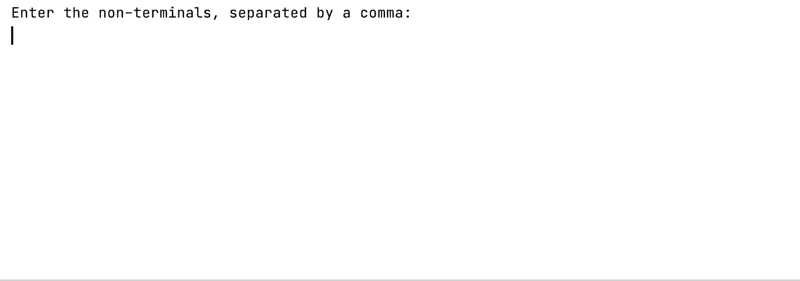

#Left Linear to Right Linear Grammar Converter
Left Linear to Right Linear is a simple C++ console application for converting a left linear type three grammar into a right linear one.
\
It functions in a relatively straightforward manner. It only asks the user to enter the terminals, the non-terminals, the starting point, and the production rules for the left linear language they want to convert.
\
Below, you can find a demo of the application:
\

