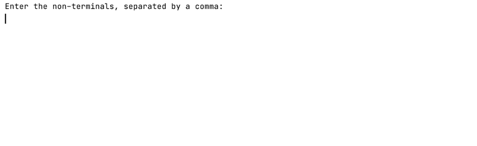
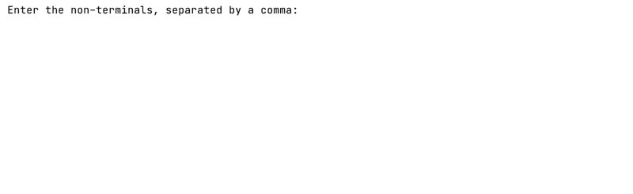

# Left Linear to Right Linear
Left Linear to Right Linear is a simple C++ console application for converting a left linear type-3 grammar into a right linear one.
\
\
Left Linear to Right Linear functions in a relatively straightforward manner. It only asks the user to enter the terminals, the non-terminals, the starting point, and the production rules for the type-3 left linear grammar they want to convert. As the program collects input from the user, the program is constructing a type-3 grammar in the background, which it will convert into a right linear one at the end.
\
\

\
\
As input gets collected from the user, the application constructs a left linear grammar in the background, which it will convert into a right linear one at the end. Suppose that during the grammar construction phase, the input given by the user causes the grammar to become non-type-3. In that case, the program will throw an appropriate error and ask the user to re-enter the symbol or production rule which has caused the error.
\
\

